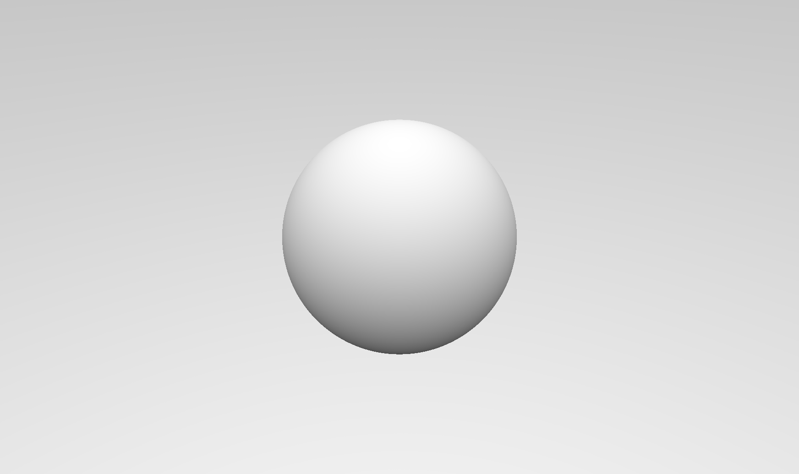
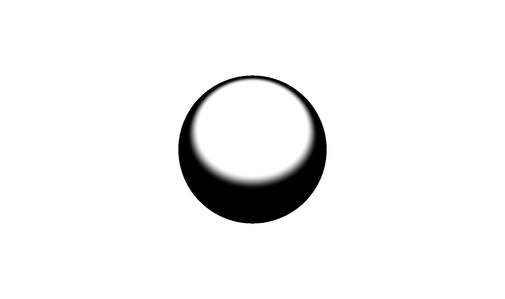

# ShaderToy for vscode Test 

最终图像,内容来自iq大神的sahdertoy
<div align=center> 


</div>

## 1. Camera的设置 

<div align=center> 


</div>

``` cpp

mat3 setCamera( in vec3 ro, in vec3 ta, float cr )
{
    vec3 cw = normalize(ta-ro);
    vec3 cp = vec3(sin(cr), cos(cr),0.0);
    vec3 cu = normalize( cross(cw,cp) );
    vec3 cv = normalize( cross(cu,cw) );
    return mat3( cu, cv, cw );
}

``` 
这个方法设置了一个转化矩阵，根据摄像机的空间位置，我们需要把摄像机转化到世界坐标系

在main()中调用 :
``` cpp

void main() {
    // camera, ro:摄像机圆心，ta：目标点 
    vec3 ro = vec3( 2 , 2 ,  4 );
    vec3 ta = vec3( 0, 0, 0 );
    // camera-to-world transformation
    mat3 ca = setCamera( ro, ta, 0.0 );
    gl_FragColor = vec4(1.0, 1.0, 1.0, 1.0);
}

``` 
为了更加可控，可以增加鼠标控制：

``` cpp

vec2 mo = iMouse.xy/iResolution.xy;

``` 

获得鼠标的空间坐标点
那么我们可以直接使用这个值进行对camera的位置更改

``` cpp

// 鼠标控制的摄像机位置 
vec3 ro = vec3( cos(mo.x), mo.y, sin(mo.x) );
// 测试
gl_FragColor = vec4(ro,1.0);

``` 

## 2. Pixel Coordinates 设置 

我们把屏幕的坐标从 0-1 ，改到 -0.5 到 0.5 
``` cpp
    vec2 p = (-iResolution.xy + 2.0*gl_FragCoord.xy)/iResolution.y;
    // 测
    gl_FragColor = vec4(p,1.0,1.0);
``` 

## 3. Ray Direction

``` cpp

    vec3 rd = ca * normalize( vec3(p.xy,2.0) );     
    // 测试
    gl_FragColor = vec4(rd,1.0);

``` 
ca * viewSpace ，把坐标空间从 viewspace 转化到世界空间 


## 4. Sphere 的 SDF 函数 

``` cpp
// p是球心位置，s是球的半径
float sdSphere( vec3 p, float s )
{
    return length(p)-s;
}
``` 

## 5. Ray Marching 

我们已经有了两个基本值，一个是相机原点 ro ，一个是光线方向 rd 

我们定义一个场景来存放所有marching的内容 

``` cpp
float map( in vec3 pos )
{
    return sdSphere( pos , 1.0 );
}
```

- 光线的位置更新： ro + rd * t ，从初始点ro开始，朝着方向rd ，走t倍的距离 
- 我们循环 Max_Step 次，代表我们最多marching 步数 ，
- 还要满足t被距离之后，不能超过我们预定的Max_Dist。
- 就算SDF函数，我们每一次都得到一个 最小 距离 h  
- 然后我们每一步都用 h 更新 t  
- 最后，当我们得到的最小距离h很接近表面时，我们就知道他已经时表面的点，我们更新一个res返回

<div align=center> 


</div>

``` cpp
vec3 castRay( in vec3 ro, in vec3 rd )
{
    vec3  res = vec3(0.0,0.0,0.0);
    float t = 0.0 ;
    for( int i = 0 ; i < Max_Step && t < Max_Dist ; i++ )
    {
        float h = map( ro+rd*t );
        if( abs(h)<( Surf_Dist * t ))
        { 
            res = vec3(t,h,1.0); 
            break;
         }
         t += h;
    }
    return res;
}
```  
当然我么还要define 这些值 
``` cpp
#define Max_Step  250 
#define Max_Dist 100.0
#define Surf_Dist 0.000001 

``` 

## 6. Render

最后，我们希望对这个图进行渲染，我们为了综合，开一个单独的函数，为了以后反射，高光，阴影等计算 

``` cpp
vec3 render( in vec3 ro, in vec3 rd )
{ 
    vec3 res = castRay(ro,rd) ;
    return vec3(res.x);
}

``` 
测试：
``` cpp

    vec3 ro = vec3( cos(mo.x)-5.0, mo.y, sin(mo.x) );

    vec3 col = render(ro,rd);
    gl_FragColor = vec4(col,1.0);

``` 
<div align=center> 


</div>


## 7. combine 

至此，我么已经渲染出一个球，我们再来回顾一下整个过程：顺便我还加入一些其他步骤

1. 更新设置鼠标和摄像机

``` cpp
void mainImage( out vec4 fragColor, in vec2 fragCoord )
{
    vec2 mo = iMouse.xy/iResolution.xy;
    float time = 15.0 + iTime;

    //cam
    vec3 ro = vec3( 4.6*cos(0.1*time + 6.0*mo.x), 1.0 + 2.0*mo.y, 0.5 + 4.6*sin(0.1*time + 6.0*mo.x) );
    vec3 ta = vec3( -0.5, -0.4, 0.5 );
    mat3 ca = setCamera( ro, ta, 0.0 );
}
``` 

2. 初始化Ray，并且调用render进行marching，加入了gamma 和 tot 总量 

``` cpp
    
    vec3 tot = vec3(0.0);
    vec2 p = (-iResolution.xy + 2.0*gl_FragCoord.xy)/iResolution.y;
    vec3 rd = ca * normalize( vec3(p.xy,2.0) );
    vec3 col = render(ro,rd);
    // gamma
    col = pow( col, vec3(0.4545) );
    tot += col;
    gl_FragColor = vec4(tot,1.0);

``` 
3. 在render函数中，我们只是简单的做了一个castRay，并没有做光照渲染。
4. castRay中，我们根据ro 和 rd ，利用sdf的sphere公式，绘制出了一个球 

## 8. normal

<div align=center> 


</div>

1. 方法一 : 
来自 iq 的网站 ： [normalsSDF](http://iquilezles.org/www/articles/normalsSDF/normalsSDF.htm)

``` cpp

vec3 calcNormal( in vec3 pos )
{
    vec2 e = vec2(1.0,-1.0)*0.5773*0.0005;
    return normalize( e.xyy*map( pos + e.xyy ) + 
					  e.yyx*map( pos + e.yyx ) + 
					  e.yxy*map( pos + e.yxy ) + 
					  e.xxx*map( pos + e.xxx ) );
}

``` 

2.方法二 : 
来自 klems 

``` cpp
vec3 calcNormal( in vec3 pos )
{
    vec3 n = vec3(0.0);
    for( int i=ZERO; i<4; i++ )
    {
        vec3 e = 0.5773*(2.0*vec3((((i+3)>>1)&1),((i>>1)&1),(i&1))-1.0);
        n += e*map(pos+0.0005*e).x;
    }
    return normalize(n);
}
``` 

我们要在render方法中计算他的法线：

``` cpp

    vec3 res = castRay(ro,rd) ;
    vec3 pos = ro + res.x * rd;
    vec3 normal = calcNormal( pos );

``` 

## 9. diffuse

既然我们法线也有了，我们现在就可以模拟一个灯光，然后做一个漫反射材质了 ：

``` cpp

vec3 render( in vec3 ro, in vec3 rd )
{ 
    vec3 col = vec3(0, 0, 0);
    vec3 res = castRay(ro,rd) ;
    vec3 normal = calcNormal(res.x * rd + ro);
    col =  sin( vec3(0.9,0.1,0.1));
    vec3  lig = normalize( vec3(-0.4, 0.7, -0.6) );
    float dif = clamp( dot( normal, lig ), 0.0, 1.0 );
    return dif * col ;
}

``` 
<div align=center> 


</div>


## 10. Other shading

当然除了diffue ,还有其他光照计算 
这里我们一共计算了
- vertex positon
- vertex normal
- vertex refect
- light direction
- half vector
- ambient color 
- back Color
- cubemap Color
- Rim Color
- Diffuse 

``` cpp

vec3 render( in vec3 ro, in vec3 rd )
{ 
    vec3 col = vec3(0, 0, 0);
    vec3 res = castRay(ro,rd) ;
    vec3 pos = res.x * rd + ro ;
    vec3 normal = calcNormal(pos);
    vec3 ref = reflect( rd, normal );
    col =  sin( vec3(0.9,0.1,0.1));
    
    
    vec3  lig = normalize( vec3(-0.4, 0.7, -0.6) );
    // Half vector 
    vec3  hal = normalize( lig-rd );
    // ambient 
    float amb = clamp( 0.5+0.5*normal.y, 0.0, 1.0 );
    // back 
    float bac = clamp( dot( normal, normalize(vec3(-lig.x,0.0,-lig.z))), 0.0, 1.0 )*clamp( 1.0-pos.y,0.0,1.0);
    // cube map rel
    float dom = smoothstep( -0.2, 0.2, ref.y );
    // rim 
    float fre = pow( clamp(1.0+dot(normal,rd),0.0,1.0), 2.0 );
    // diffuse 
    float dif = clamp( dot( normal, lig ), 0.0, 1.0 );
    
    return vec3(fre);

}
``` 
可以逐个的输出测试：
<div align=center> 







</div>

## 11. plane 地面 

我们在castray的时候指定一个范围来当作地面 

``` cpp

    float tmax = Max_Dist ;
    float tp1 = (0.0-ro.y)/rd.y;
    if( tp1>0.0 )
    {
        tmax = min( tmax, tp1 );
        res = vec3( tp1, 1.0 ,1.0);
    }

```

<div align=center> 


</div>

## 12. 材质分离 

我们需要一种方法来区分不同的问题，地板还是sphere？
所以我们把map函数改一下，我们增加一个通道来区分他们
``` cpp
vec2 map( in vec3 pos )
{
    return vec2(sdSphere(  pos, 1.0 ),40) ;
}
``` 
第二个通道随便指定一个值就行 

此外我们就很多地方需要修改一下 
calcNormal函数中返回指定x通道
castRay函数中，判断指定x通道，res指定y通道
``` cpp
    for( int i = 0 ; i < Max_Step && t < Max_Dist ; i++ )
    {
        vec2 h = map( ro+rd*t );
        if( abs(h.x)<( Surf_Dist * t ))
        { 
            res = vec3(t,h.y,1.0); 
            break;
         }
         t += h.x;
    }
    return res;

``` 
同样报错的地方，比如法线计算，我们也要指定到x通道

这样我们就可以根据res的y通道来区分材质了

``` cpp

vec3 render( in vec3 ro, in vec3 rd )
{ 
    vec3 col = vec3(0, 0, 0);
    vec3 res = castRay(ro,rd) ;
    float m = res.y;
    vec3 pos = res.x * rd + ro ;
    vec3 normal = calcNormal(pos);
    vec3 ref = reflect( rd, normal );
    // light dir 
    vec3  lig = normalize( vec3(-0.4, 0.7, -0.6) );
    // Half vector 
    vec3  hal = normalize( lig-rd );
    // ambient 
    float amb = clamp( 0.5+0.5*normal.y, 0.0, 1.0 );
    // back 
    float bac = clamp( dot( normal, normalize(vec3(-lig.x,0.0,-lig.z))), 0.0, 1.0 )*clamp( 1.0-pos.y,0.0,1.0);
    // cube map rel
    float dom = smoothstep( -0.2, 0.2, ref.y );
    // rim 
    float fre = pow( clamp(1.0+dot(normal,rd),0.0,1.0), 2.0 );
    // diffuse 
    float dif = clamp( dot( normal, lig ), 0.0, 1.0 );

    if( m>-0.5 ){
    
        if(m<1.5)
        	return vec3(1.0,1.0,1.0);
    	col =  sin( vec3(0.9,0.1,0.1));
    
    }
    return col ;
}

``` 
<div align=center> 


</div>


## 13. plane Checkboard
同样来自iq大神的文章 
[checkerfiltering](http://iquilezles.org/www/articles/checkerfiltering/checkerfiltering.htm)
``` cpp
// 
float checkersGradBox( in vec2 p )
{
    // filter kernel
    vec2 w = fwidth(p) + 0.001;
    // analytical integral (box filter)
    vec2 i = 2.0*(abs(fract((p-0.5*w)*0.5)-0.5)-abs(fract((p+0.5*w)*0.5)-0.5))/w;
    // xor pattern
    return 0.5 - 0.5*i.x*i.y;                  
}

```

在地板选择材质中调用他 ：
``` cpp

        if(m<1.5)
        {  
            float f = checkersGradBox( 5.0*pos.xz );
            col = 0.3 + f*vec3(0.1);
            return col ;
        }

```
我们在更新一下球：
``` cpp

vec2 map( in vec3 pos )
{
    return vec2(sdSphere(  pos - vec3(0.0,0.25,0.0), 0.25 ),40) ;
}

``` 

<div align=center> 


</div>

## 14. 计算AO 

``` cpp

float calcAO( in vec3 pos, in vec3 nor )
{
	float occ = 0.0;
    float sca = 1.0;
    for( int i=0; i<5; i++ )
    {
        float hr = 0.01 + 0.12*float(i)/4.0;
        vec3 aopos =  nor * hr + pos;
        float dd = map( aopos ).x;
        occ += -(dd-hr)*sca;
        sca *= 0.95;
    }
    return clamp( 1.0 - 3.0*occ, 0.0, 1.0 ) * (0.5+0.5*nor.y);
}

``` 

``` cpp

    // lighting
    float occ = calcAO( pos, normal );

``` 
<div align=center> 


</div>


## 15.重置render函数

我们回过头去重新看代码，我重新理了一下render函数，使他看起来更加流畅：
``` cpp
vec3 render( in vec3 ro, in vec3 rd )
{ 
    vec3 col = vec3(0.7, 0.9, 1.0) + rd.y * 0.8 ;
    vec3 res = castRay(ro,rd) ;
    float t = res.x;
	float m = res.y;    
    if( m>-0.5 ){

      vec3 pos = t * rd + ro ;
      vec3 nor = (m<1.5) ? vec3(0.0,1.0,0.0) : calcNormal( pos );
      vec3 ref = reflect( rd, nor );

      col = 0.45 + 0.35*sin( vec3(0.05,0.08,0.10)*(m-1.0) );
      if( m<1.5 )
      {
          
          float f = checkersGradBox( 5.0*pos.xz );
          col = 0.3 + f*vec3(0.1);
      }
        // lighting
      float occ = calcAO( pos, nor );
	    vec3  lig = normalize( vec3(-0.4, 0.7, -0.6) );
      vec3  hal = normalize( lig-rd );
	    float amb = clamp( 0.5+0.5*nor.y, 0.0, 1.0 );
      float dif = clamp( dot( nor, lig ), 0.0, 1.0 );
      float bac = clamp( dot( nor, normalize(vec3(-lig.x,0.0,-lig.z))), 0.0, 1.0 )*clamp( 1.0-pos.y,0.0,1.0);
      float dom = smoothstep( -0.2, 0.2, ref.y );
      float fre = pow( clamp(1.0+dot(nor,rd),0.0,1.0), 2.0 );
      
    }
   return col ;
}
``` 


## 16. 组合颜色
``` cpp

      	vec3 lin = vec3(0.0);
        lin += 1.40*dif*vec3(1.00,0.80,0.55);
        lin += 0.20*amb*vec3(0.40,0.60,1.00)*occ;
        lin += 0.40*dom*vec3(0.40,0.60,1.00)*occ;
        lin += 0.50*bac*vec3(0.25,0.25,0.25)*occ;
        lin += 0.25*fre*vec3(1.00,1.00,1.00)*occ;
        col = col*lin;
        col = mix( col, vec3(0.8,0.9,1.0), 1.0-exp( -0.0002*t*t*t ) );
        
``` 
最后返回颜色时，最好clamp一下
<div align=center> 


</div>


## 17.计算高光

``` cpp

		float spe = pow( clamp( dot( nor, hal ), 0.0, 1.0 ),16.0)*
                    dif *
                    (0.04 + 0.96*pow( clamp(1.0+dot(hal,rd),0.0,1.0), 5.0 ));
        
        col = col*lin;
		// 合并高光 
        col += 9.00*spe*vec3(1.00,0.90,0.70);
        col = mix( col, vec3(0.8,0.9,1.0), 1.0-exp( -0.0002*t*t*t ) );

``` 


## 18.计算shadow

``` cpp

const float maxHei = 0.8;
#define ZERO (min(iFrame,0))
float calcSoftshadow( in vec3 ro, in vec3 rd, in float mint, in float tmax )
{
    // bounding volume
    float tp = (maxHei-ro.y)/rd.y; if( tp>0.0 ) tmax = min( tmax, tp );

    float res = 1.0;
    float t = mint;
    for( int i=0; i<16; i++ )
    {
		float h = map( ro + rd*t ).x;
        res = min( res, 8.0*h/t );
        t += clamp( h, 0.02, 0.10 );
        if( res<0.005 || t>tmax ) break;
    }
    return clamp( res, 0.0, 1.0 );
}

``` 

在render中合并 ：
``` cpp

      dif *= calcSoftshadow( pos, lig, 0.02, 2.5 );
      dom *= calcSoftshadow( pos, ref, 0.02, 2.5 );

``` 

## 19. 修正天空
在castray 初始化时： 
``` cpp
vec3 res = vec3(0.0,-1.0,0.0);
``` 

## 20.抗锯齿

定义抗锯齿等级 
``` cpp
#define AA 3   // make this 2 or 3 for antialiasing

``` 

在主循环中：

``` cpp

#if AA>1
    for( int m=ZERO; m<AA; m++ )
    for( int n=ZERO; n<AA; n++ )
    {
        // pixel coordinates
        vec2 o = vec2(float(m),float(n)) / float(AA) - 0.5;
        vec2 p = (-iResolution.xy + 2.0*(gl_FragCoord.xy + o))/iResolution.y;
#else    
        vec2 p = (-iResolution.xy + 2.0*gl_FragCoord.xy )/iResolution.y;
#endif

        // ray direction
        vec3 rd = ca * normalize( vec3(p.xy,2.0) );

        // render	
        vec3 col = render( ro, rd );

		// gamma
        col = pow( col, vec3(0.4545) );

        tot += col;
#if AA>1
    }
    tot /= float(AA*AA);
#endif
	gl_FragColor = vec4( tot, 1.0 );
    
``` 