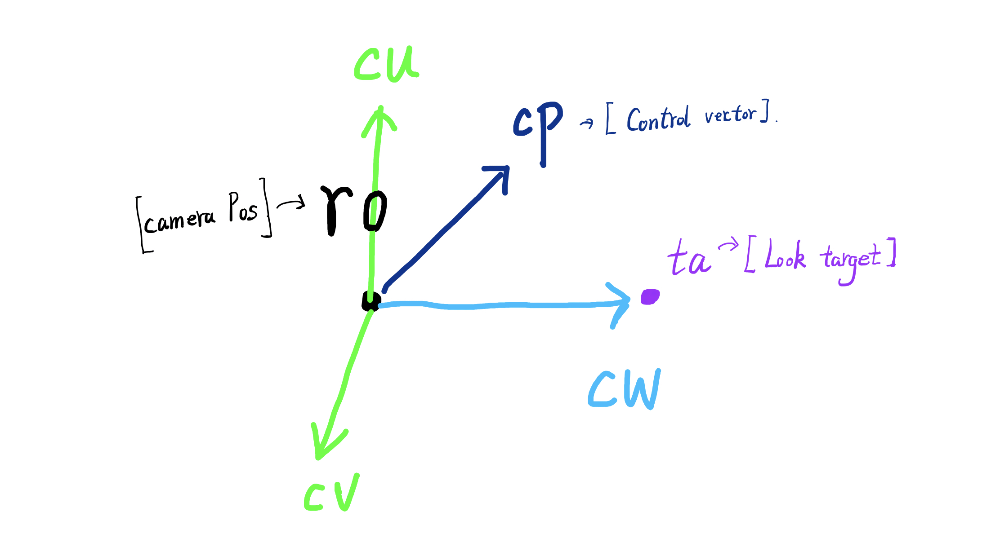

## Camera

<div align=center> 



</div>

``` cpp

mat3 setCamera( in vec3 ro, in vec3 ta, float cr )
{
    vec3 cw = normalize(ta-ro);
    vec3 cp = vec3(sin(cr), cos(cr),0.0);
    vec3 cu = normalize( cross(cw,cp) );
    vec3 cv = normalize( cross(cu,cw) );
    return mat3( cu, cv, cw );
}

``` 


在main()中调用 :
``` cpp

    // camera	
    vec3 ro = vec3( 2 , 2 ,  4 );
    vec3 ta = vec3( 0, 0, 0 );
    // camera-to-world transformation
    mat3 ca = setCamera( ro, ta, 0.0 );

``` 

增加鼠标控制：

``` cpp

vec2 mo = iMouse.xy/iResolution.xy;

``` 
获得鼠标的空间坐标点
那么我们可以直接使用这个值进行对camera的位置更改

``` cpp

vec3 ro = vec3( cos(mo.x), mo.y, sin(mo.x) );

``` 
<div align=center> 


</div>

## Pixel Coordinates

我们把坐标从0-1 ，改到 -0.5 到 0.5 
``` cpp
    vec2 p = (-iResolution.xy + 2.0*fragCoord)/iResolution.y;
``` 

## Ray Direction

``` cpp
    vec3 rd = ca * normalize( vec3(p.xy,2.0) );     
``` 
ca * viewSpace ，把坐标空间从 viewspace 转化到世界空间 


## Marching Sphere

``` cpp
float sdSphere( vec3 p, float s )
{
    return length(p)-s;
}
``` 

## Ray Marching

我们已经有了两个基本值，一个是相机原点 ro ，一个是光线方向 rd 

我们定义一个场景来存放所有marching的内容 

``` cpp
float map( in vec3 pos )
{
    return sdSphere( pos - vec3( 0.0,0.0, 0.0 ), 1.0 );
}
```

- 光线的位置更新： ro + rd * t ，从初始点ro开始，朝着方向rd ，走t倍的距离 
- 我们循环 Max_Step 次，代表我们最多marching 步数 ，
- 还要满足t被距离之后，不能超过我们预定的Max_Dist。
- 就算SDF函数，我们每一次都得到一个 最小 距离 h  
- 然后我们每一步都用 h 更新 t  
- 最后，当我们得到的最小距离h很接近表面时，我们就知道他已经时表面的点，我们更新一个res返回

<div align=center> 


</div>

``` cpp
vec3 castRay( in vec3 ro, in vec3 rd )
{
    vec3  res = vec3(0.0,0.0,0.0);
    float t = 0.0 ;
    for( int i = 0 ; i < Max_Step && t < Max_Dist ; i++ )
    {
        float h = map( ro+rd*t );
        if( abs(h)<( Surf_Dist * t ))
        { 
            res = vec3(t,h,1.0); 
            break;
         }
         t += h;
    }
    return res;
}
```  

## Render

最后，我们希望对这个图进行渲染，我们为了综合，开一个单独的函数，为了以后反射，高光，阴影等计算 

``` cpp
vec3 render( in vec3 ro, in vec3 rd )
{ 
    vec3 res = castRay(ro,rd) ;
    return vec3(res.x);
}

``` 
## combine 

最后的最后，我们再来回顾一下整个过程：

1. 设置鼠标和摄像机

``` cpp
void mainImage( out vec4 fragColor, in vec2 fragCoord )
{
    vec2 mo = iMouse.xy/iResolution.xy;
	float time = 15.0 + iTime;
    // camera	
    vec3 ro = vec3( 4.6*cos(0.1*time + 6.0*mo.x), 1.0 + 2.0*mo.y, 0.5 + 4.6*sin(0.1*time + 6.0*mo.x) );
    vec3 ta = vec3( -0.5, -0.4, 0.5 );
    // camera-to-world transformation
    mat3 ca = setCamera( ro, ta, 0.0 );
}
``` 

2. 初始化Ray，并且调用render进行marching 

``` cpp

    vec3 tot = vec3(0.0);
	vec2 p = (-iResolution.xy + 2.0*fragCoord)/iResolution.y;
     // ray direction
    vec3 rd = ca * normalize( vec3(p.xy,2.0) );
    // render	
    vec3 col = render( ro, rd );

    tot += col;

    // 最后输出颜色 
    fragColor = vec4( tot, 1.0 );
``` 
3. 在render函数中，我们只是简单的做了一个castRay，并没有做光照渲染。
4. castRay中，我们根据ro 和 rd ，利用sdf的sphere公式，绘制出了一个球 

## next:

下一步，我们进行光照渲染和影子等渲染
<div align=center> 


</div>