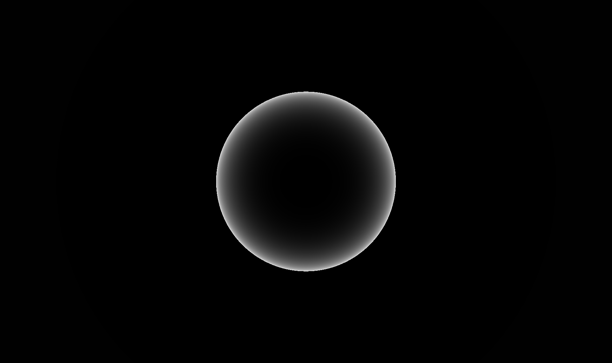

## normal

<div align=center> 


</div>

1. 方法一 : 
来自 iq 的网站 ： [normalsSDF](http://iquilezles.org/www/articles/normalsSDF/normalsSDF.htm)

``` cpp

vec3 calcNormal( in vec3 pos )
{
    vec2 e = vec2(1.0,-1.0)*0.5773*0.0005;
    return normalize( e.xyy*map( pos + e.xyy ) + 
					  e.yyx*map( pos + e.yyx ) + 
					  e.yxy*map( pos + e.yxy ) + 
					  e.xxx*map( pos + e.xxx ) );
}

``` 

2.方法二 : 
来自 klems 

``` cpp
vec3 calcNormal( in vec3 pos )
{
    vec3 n = vec3(0.0);
    for( int i=ZERO; i<4; i++ )
    {
        vec3 e = 0.5773*(2.0*vec3((((i+3)>>1)&1),((i>>1)&1),(i&1))-1.0);
        n += e*map(pos+0.0005*e).x;
    }
    return normalize(n);
}
``` 

我们要在render方法中计算他的法线：

``` cpp

    vec3 res = castRay(ro,rd) ;
    vec3 pos = ro + res.x * rd;
    vec3 normal = calcNormal( pos );

``` 

## diffuse

既然我们法线也有了，我们现在就可以模拟一个灯光，然后做一个漫反射材质了 ：

``` cpp

vec3 render( in vec3 ro, in vec3 rd )
{ 
    vec3 col = vec3(0, 0, 0);
    vec3 res = castRay(ro,rd) ;
    vec3 normal = calcNormal(res.x * rd + ro);
    col =  sin( vec3(0.9,0.1,0.1));
    vec3  lig = normalize( vec3(-0.4, 0.7, -0.6) );
    float dif = clamp( dot( normal, lig ), 0.0, 1.0 );
    return dif * col ;
}

``` 
<div align=center> 


</div>


## other shading

``` cpp

vec3 render( in vec3 ro, in vec3 rd )
{ 
    vec3 col = vec3(0, 0, 0);
    vec3 res = castRay(ro,rd) ;
    vec3 pos = res.x * rd + ro ;
    vec3 normal = calcNormal(pos);
    vec3 ref = reflect( rd, normal );
    col =  sin( vec3(0.9,0.1,0.1));
    
    
    vec3  lig = normalize( vec3(-0.4, 0.7, -0.6) );
    // Half vector 
    vec3  hal = normalize( lig-rd );
    // ambient 
    float amb = clamp( 0.5+0.5*normal.y, 0.0, 1.0 );
    // back 
    float bac = clamp( dot( normal, normalize(vec3(-lig.x,0.0,-lig.z))), 0.0, 1.0 )*clamp( 1.0-pos.y,0.0,1.0);
    // cube map rel
    float dom = smoothstep( -0.2, 0.2, ref.y );
    // rim 
    float fre = pow( clamp(1.0+dot(normal,rd),0.0,1.0), 2.0 );
    // diffuse 
    float dif = clamp( dot( normal, lig ), 0.0, 1.0 );
    
    return vec3(fre);

}
``` 
<div align=center> 




</div>

## plane 地面 

我们在castray的时候指定一个范围来当作地面 

``` cpp

    float tp1 = (0.0-ro.y)/rd.y;
    if( tp1>0.0 )
    {
        tmax = min( tmax, tp1 );
        res = vec3( tp1, 1.0 ,1.0);
    }

```

这样会影响球的位置，那么我们也把球更新一下位置 

``` cpp

float map( in vec3 pos )
{
    return sdSphere( pos-vec3( 0.0,0.25, 0.0), 0.25 );
}

``` 

