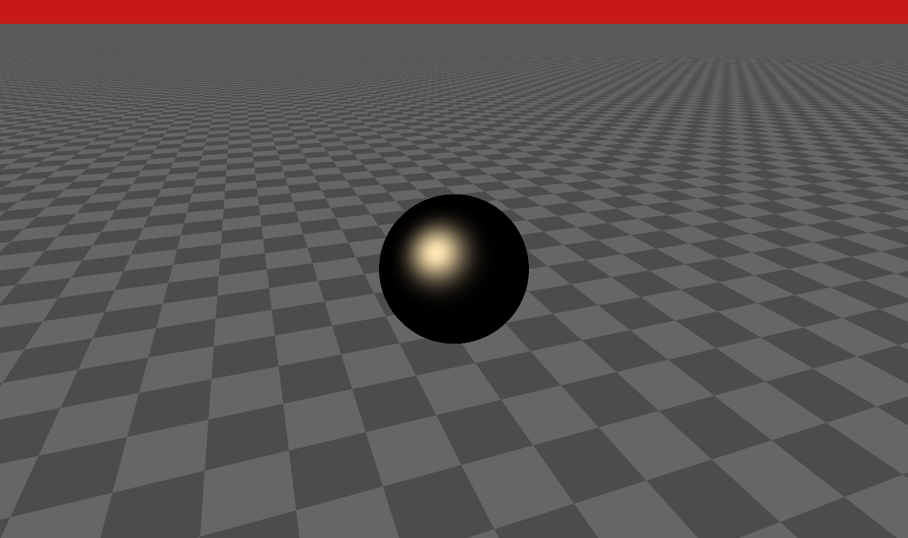
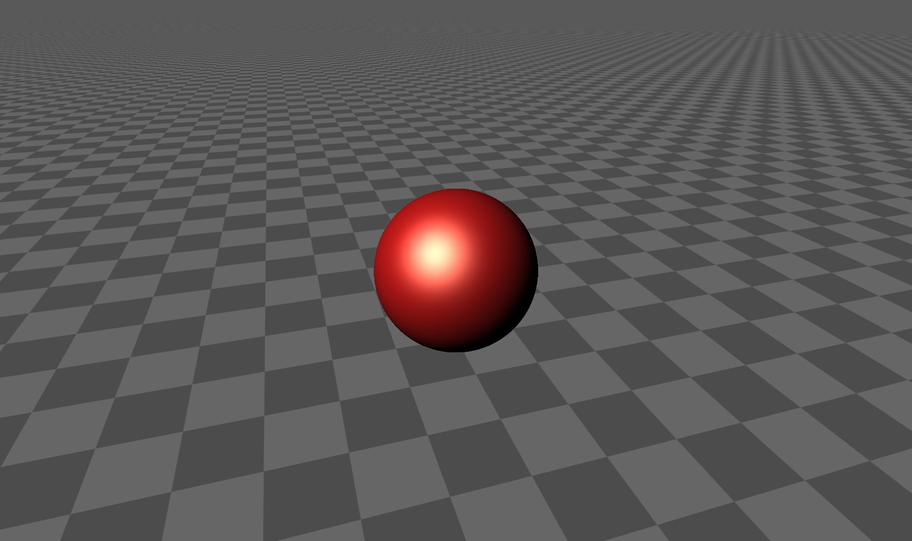

## 计算AO 

``` cpp

float calcAO( in vec3 pos, in vec3 nor )
{
	float occ = 0.0;
    float sca = 1.0;
    for( int i=0; i<5; i++ )
    {
        float hr = 0.01 + 0.12*float(i)/4.0;
        vec3 aopos =  nor * hr + pos;
        float dd = map( aopos ).x;
        occ += -(dd-hr)*sca;
        sca *= 0.95;
    }
    return clamp( 1.0 - 3.0*occ, 0.0, 1.0 ) * (0.5+0.5*nor.y);
}

``` 

<div align=center> 


</div>


## 计算高光

``` cpp
float spe = pow( clamp( dot( normal, hal ), 0.0, 1.0 ),16.0);
``` 
<div align=center> 



</div>

加到漫反射上

<div align=center> 



</div>

